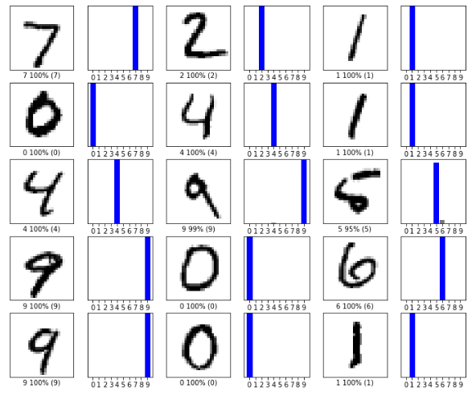
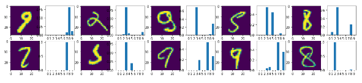
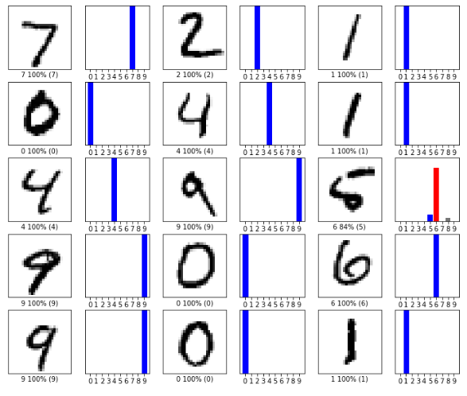
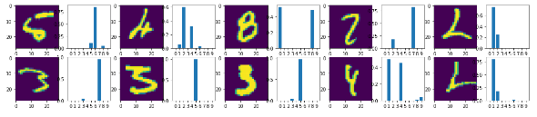
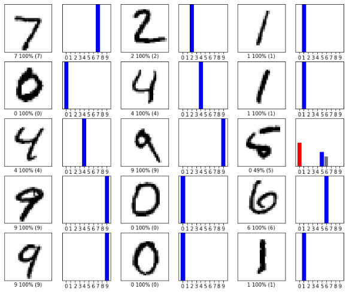
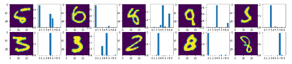

# MNIST

## Results

Using the mnist dataset:

|            |  **loss**  | **accuracy** |
|------------|-----------:|-------------:|
| **first**  |     0.1279 |       0.9685 |
| **second** |     0.0614 |       0.9833 |
| **third**  |     0.0546 |       0.9855 |

### First model:

Here are the 35 first predictions, each can be a success or a failure:

Here are the 10 first failure:

### Second model:

Here are the 35 first predictions, each can be a success or a failure:

Here are the 10 first failure:

### Third model:

Here are the 35 first predictions, each can be a success or a failure:

Here are the 10 first failure:

